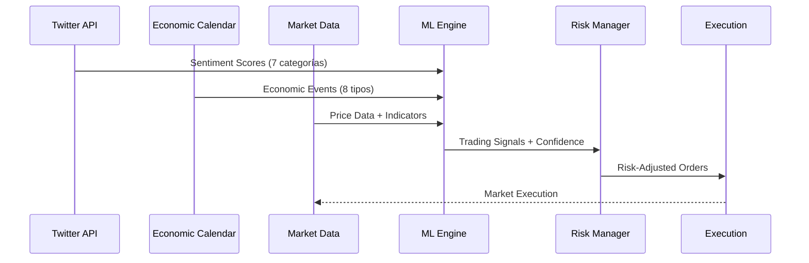

# 🔬 **DOCUMENTACIÓN TÉCNICA COMPLETA - BOT SMC-LIT v2.0**

## 📖 **ÍNDICE TÉCNICO**

1. [Arquitectura General](#arquitectura-general)
2. [Análisis de Sentimiento Twitter](#análisis-de-sentimiento-twitter)
3. [Calendario Económico FinBERT](#calendario-económico-finbert)
4. [Sistema de Machine Learning](#sistema-de-machine-learning)
5. [Motor de Trading](#motor-de-trading)
6. [Gestión de Riesgo](#gestión-de-riesgo)
7. [Sistema de Deployment](#sistema-de-deployment)

---

## 🏗️ **ARQUITECTURA GENERAL**

### **🔧 Componentes Core**

```python
# Estructura principal del sistema
class AdvancedTradingBotWithIndices:
    """
    Bot principal que integra todos los componentes:
    - Twitter Analysis (7 categorías)
    - Economic Calendar (8 tipos de eventos)
    - Machine Learning (12 features)
    - Risk Management (algoritmo adaptativo)
    - Multi-Asset Trading (FOREX + Índices)
    """
    
    def __init__(self):
        self.twitter_analyzer = AdvancedTwitterNewsAnalyzer()
        self.calendar_analyzer = EconomicCalendarAnalyzer()
        self.ml_system = AdvancedMLTradingSystem()
        self.symbols = [
            # FOREX (8 pares)
            'EURUSD', 'GBPUSD', 'USDJPY', 'AUDUSD',
            'EURJPY', 'EURGBP', 'GBPJPY', 'USDCAD',
            # ÍNDICES (5 mercados)
            'NAS100', 'SPX500', 'US30', 'GER40', 'UK100'
        ]
        self.timeframes = ['M1', 'M5', 'M15', 'M30', 'H1', 'H4', 'D1']
```

### **📊 Flujo de Datos**



---

## 🐦 **ANÁLISIS DE SENTIMIENTO TWITTER**

### **🎯 Sistema de 7 Categorías**

```python
class AdvancedTwitterNewsAnalyzer:
    """
    Análisis avanzado de Twitter con 7 categorías especializadas
    """
    
    def __init__(self):
        self.categories = {
            'fed_powell': {
                'keywords': ['fed', 'powell', 'interest rate', 'monetary policy', 'fomc'],
                'weight': 0.25,
                'impact_forex': True,
                'impact_indices': True
            },
            'indicadores_economicos': {
                'keywords': ['cpi', 'nfp', 'gdp', 'unemployment', 'inflation'],
                'weight': 0.20,
                'impact_forex': True,
                'impact_indices': False
            },
            'indices_mercado': {
                'keywords': ['nasdaq', 'sp500', 'dow jones', 'earnings', 'quarterly'],
                'weight': 0.15,
                'impact_forex': False,
                'impact_indices': True
            },
            'geopolitica': {
                'keywords': ['war', 'election', 'sanctions', 'trade war', 'conflict'],
                'weight': 0.15,
                'impact_forex': True,
                'impact_indices': True
            },
            'criptomonedas': {
                'keywords': ['bitcoin', 'ethereum', 'crypto', 'defi', 'regulation'],
                'weight': 0.10,
                'impact_forex': False,
                'impact_indices': False
            },
            'commodities': {
                'keywords': ['oil', 'gold', 'silver', 'natural gas', 'agriculture'],
                'weight': 0.10,
                'impact_forex': True,
                'impact_indices': False
            },
            'banca_finanzas': {
                'keywords': ['bank', 'financial crisis', 'credit', 'loan', 'debt'],
                'weight': 0.05,
                'impact_forex': True,
                'impact_indices': True
            }
        }
```

### **⚡ Algoritmo de Análisis**

```python
def analyze_sentiment_by_category(self, news_text):
    """
    Análisis granular por categoría con ponderación dinámica
    """
    
    # 1. Detección de categoría
    category_scores = {}
    for category, config in self.categories.items():
        score = 0
        for keyword in config['keywords']:
            # Búsqueda case-insensitive con variaciones
            matches = len(re.findall(rf'\b{keyword}\b', news_text, re.IGNORECASE))
            score += matches * config['weight']
        
        # Análisis de sentimiento específico
        if score > 0:
            sentiment = self.analyze_text_sentiment(news_text, category)
            category_scores[category] = {
                'relevance': score,
                'sentiment': sentiment,
                'confidence': self.calculate_confidence(news_text, category)
            }
    
    # 2. Combinación ponderada
    final_sentiment = self.combine_category_sentiments(category_scores)
    
    return {
        'sentiment_general': final_sentiment,
        'categories': category_scores,
        'market_impact': self.calculate_market_impact(category_scores)
    }
```

---

## 📅 **CALENDARIO ECONÓMICO FINBERT**

### **🧠 Sistema FinBERT para Análisis de Eventos**

```python
class EconomicCalendarAnalyzer:
    """
    Análisis de calendario económico con modelo FinBERT
    """
    
    def __init__(self):
        self.event_types = {
            'interest_rates': {
                'events': ['Fed Funds Rate', 'ECB Rate Decision', 'BOE Rate'],
                'impact_weight': 0.30,
                'finbert_context': 'monetary_policy'
            },
            'employment': {
                'events': ['Non-Farm Payrolls', 'Unemployment Rate', 'Jobless Claims'],
                'impact_weight': 0.25,
                'finbert_context': 'employment_data'
            },
            'inflation': {
                'events': ['CPI', 'Core CPI', 'PPI', 'PCE'],
                'impact_weight': 0.20,
                'finbert_context': 'inflation_indicators'
            },
            'growth': {
                'events': ['GDP', 'Retail Sales', 'PMI Manufacturing'],
                'impact_weight': 0.15,
                'finbert_context': 'economic_growth'
            },
            'earnings': {
                'events': ['Apple Earnings', 'NVIDIA Earnings', 'Microsoft Earnings'],
                'impact_weight': 0.05,
                'finbert_context': 'corporate_earnings'
            },
            'confidence': {
                'events': ['Consumer Confidence', 'Business Sentiment'],
                'impact_weight': 0.03,
                'finbert_context': 'market_sentiment'
            },
            'trade': {
                'events': ['Trade Balance', 'Import/Export Data'],
                'impact_weight': 0.02,
                'finbert_context': 'trade_data'
            }
        }
```

### **🎯 Algoritmo de Impacto**

```python
def analyze_event_impact(self, event_name, event_description):
    """
    Análisis de impacto con FinBERT contextualizado
    """
    
    # 1. Clasificación de evento
    event_type = self.classify_event_type(event_name)
    
    # 2. Análisis FinBERT contextual
    finbert_result = self.finbert_analysis(
        text=event_description,
        context=self.event_types[event_type]['finbert_context']
    )
    
    # 3. Cálculo de impacto de mercado
    market_impact = self.calculate_market_impact(
        event_type=event_type,
        sentiment_score=finbert_result['sentiment_score'],
        confidence=finbert_result['confidence'],
        timing=self.get_market_timing()
    )
    
    return {
        'event_type': event_type,
        'sentiment_score': finbert_result['sentiment_score'],
        'sentiment_label': finbert_result['sentiment_label'],
        'confidence': finbert_result['confidence'],
        'market_impact': market_impact,
        'trading_signals': self.generate_trading_signals(market_impact)
    }
```

---

## 🤖 **SISTEMA DE MACHINE LEARNING**

### **📊 12 Características de Análisis**

```python
class AdvancedMLTradingSystem:
    """
    Sistema ML con 12 features y modelos ensemble
    """
    
    def extract_features(self, symbol, timeframe):
        """
        Extracción de 12 características clave
        """
        features = {}
        
        # 1-2. Sentiment Scores
        features['twitter_sentiment'] = self.get_twitter_sentiment()
        features['calendar_sentiment'] = self.get_calendar_sentiment()
        
        # 3-4. Volatilidad y Volumen
        features['volatility'] = self.calculate_volatility(symbol, timeframe)
        features['volume_flow'] = self.analyze_volume_flow(symbol)
        
        # 5-6. Price Action
        features['price_momentum'] = self.calculate_momentum(symbol, timeframe)
        features['price_change_24h'] = self.get_price_change(symbol, '24h')
        
        # 7. News Impact
        features['news_engagement'] = self.calculate_news_engagement()
        
        # 8-14. Category Scores (7 Twitter + 8 Calendar - 1 overlap)
        category_scores = self.get_all_category_scores()
        for category, score in category_scores.items():
            features[f'category_{category}'] = score
            
        # 15. Technical Indicators
        features['technical_composite'] = self.calculate_technical_composite(symbol, timeframe)
        
        return features
```

### **🎯 Modelos Ensemble**

```python
def train_ensemble_models(self, training_data):
    """
    Entrenamiento de múltiples modelos con ensemble
    """
    
    # Modelo 1: Random Forest para direcciones
    self.rf_model = RandomForestClassifier(
        n_estimators=100,
        max_depth=10,
        random_state=42
    )
    
    # Modelo 2: SVM para patrones complejos
    self.svm_model = SVC(
        kernel='rbf',
        C=1.0,
        probability=True,
        random_state=42
    )
    
    # Modelo 3: Gradient Boosting para precisión
    self.gb_model = GradientBoostingClassifier(
        n_estimators=50,
        learning_rate=0.1,
        max_depth=6
    )
    
    # Entrenamiento paralelo
    for model in [self.rf_model, self.svm_model, self.gb_model]:
        model.fit(training_data['features'], training_data['targets'])
    
    # Ensemble con ponderación dinámica
    self.ensemble_weights = self.calculate_dynamic_weights(training_data)
```

---

## 💱 **MOTOR DE TRADING**

### **⚡ Lógica de Decisión Multi-Asset**

```python
def make_trading_decision(self, symbol, timeframe):
    """
    Decisión de trading integrando todas las fuentes
    """
    
    # 1. Recopilar análisis de todas las fuentes
    twitter_analysis = self.twitter_analyzer.get_latest_analysis()
    calendar_analysis = self.calendar_analyzer.get_current_events()
    ml_prediction = self.ml_system.predict(symbol, timeframe)
    
    # 2. Análisis técnico específico del activo
    technical_analysis = self.analyze_technical_indicators(symbol, timeframe)
    
    # 3. Verificación de condiciones de mercado
    market_conditions = self.assess_market_conditions(symbol)
    
    # 4. Combinación inteligente con pesos dinámicos
    combined_signal = self.combine_signals(
        twitter_weight=twitter_analysis['confidence'] * 0.3,
        calendar_weight=calendar_analysis['impact_score'] * 0.3,
        ml_weight=ml_prediction['confidence'] * 0.25,
        technical_weight=technical_analysis['strength'] * 0.15
    )
    
    # 5. Filtros de calidad
    if not self.passes_quality_filters(combined_signal, market_conditions):
        return {'action': 'HOLD', 'reason': 'Quality filters failed'}
    
    # 6. Determinación de acción
    if combined_signal['score'] > 0.65:
        action = 'BUY'
    elif combined_signal['score'] < -0.65:
        action = 'SELL'
    else:
        action = 'HOLD'
    
    return {
        'action': action,
        'confidence': combined_signal['confidence'],
        'entry_price': self.get_current_price(symbol),
        'stop_loss': self.calculate_stop_loss(symbol, action),
        'take_profit': self.calculate_take_profit(symbol, action),
        'position_size': self.calculate_position_size(symbol, combined_signal['confidence'])
    }
```

---

## 🛡️ **GESTIÓN DE RIESGO**

### **📊 Algoritmo Adaptativo de Riesgo**

```python
class AdaptiveRiskManager:
    """
    Gestión de riesgo que se adapta a condiciones de mercado
    """
    
    def calculate_position_size(self, symbol, confidence, market_volatility):
        """
        Cálculo dinámico del tamaño de posición
        """
        
        # Base risk: 1% del capital
        base_risk = 0.01
        
        # Ajuste por volatilidad (0.5x - 2.0x)
        volatility_multiplier = max(0.5, min(2.0, 1 / market_volatility))
        
        # Ajuste por confianza (0.5x - 1.5x)
        confidence_multiplier = max(0.5, min(1.5, confidence * 1.5))
        
        # Ajuste por correlación con posiciones existentes
        correlation_adjustment = self.calculate_correlation_adjustment(symbol)
        
        # Cálculo final
        final_risk = (base_risk * 
                     volatility_multiplier * 
                     confidence_multiplier * 
                     correlation_adjustment)
        
        # Límites absolutos
        final_risk = max(0.005, min(0.03, final_risk))  # 0.5% - 3%
        
        return final_risk
    
    def calculate_stop_loss(self, symbol, entry_price, action, timeframe):
        """
        Stop loss adaptativo basado en ATR y volatilidad
        """
        
        # ATR para volatilidad real
        atr = self.calculate_atr(symbol, timeframe, periods=14)
        
        # Multiplicador basado en timeframe
        timeframe_multipliers = {
            'M1': 1.5, 'M5': 2.0, 'M15': 2.5,
            'M30': 3.0, 'H1': 3.5, 'H4': 4.0, 'D1': 5.0
        }
        
        multiplier = timeframe_multipliers.get(timeframe, 2.0)
        
        # Cálculo de stop loss
        if action == 'BUY':
            stop_loss = entry_price - (atr * multiplier)
        else:  # SELL
            stop_loss = entry_price + (atr * multiplier)
        
        return stop_loss
```

---

## 🚀 **SISTEMA DE DEPLOYMENT**

### **🐧 Deployment Linux Automatizado**

```python
class LinuxProductionDeployment:
    """
    Sistema completo de deployment para Linux con SystemD
    """
    
    def setup_systemd_service(self):
        """
        Configuración de servicio SystemD profesional
        """
        
        service_config = f"""[Unit]
Description=SMC-LIT Trading Bot v2.0 - Linux Production
After=network.target network-online.target
Wants=network-online.target
StartLimitIntervalSec=300
StartLimitBurst=5

[Service]
Type=simple
Restart=always
RestartSec=30
User=root
Group=root
WorkingDirectory={self.production_dir}
ExecStart=/bin/bash {self.production_dir}/start_production.sh
StandardOutput=journal
StandardError=journal
Environment="PYTHONUNBUFFERED=1"
Environment="PYTHONPATH={self.production_dir}"
Environment="SMC_BOT_MODE=production_linux"

# Límites de recursos
MemoryMax=1G
CPUQuota=50%
TasksMax=100

# Configuración de reinicio
KillMode=mixed
KillSignal=SIGTERM
TimeoutStopSec=60

[Install]
WantedBy=multi-user.target"""
        
        return service_config
```

### **📊 Sistema de Monitoreo**

```python
def monitor_system_health(self):
    """
    Monitoreo continuo del sistema
    """
    
    health_metrics = {
        'memory_usage': self.get_memory_usage(),
        'cpu_usage': self.get_cpu_usage(),
        'active_connections': self.count_active_connections(),
        'trading_signals_per_hour': self.count_recent_signals(),
        'error_rate': self.calculate_error_rate(),
        'uptime': self.get_uptime()
    }
    
    # Alertas automáticas
    if health_metrics['memory_usage'] > 0.8:  # 80% RAM
        self.send_alert('HIGH_MEMORY_USAGE', health_metrics['memory_usage'])
    
    if health_metrics['error_rate'] > 0.1:  # 10% error rate
        self.send_alert('HIGH_ERROR_RATE', health_metrics['error_rate'])
    
    if health_metrics['trading_signals_per_hour'] < 5:  # Muy pocas señales
        self.send_alert('LOW_ACTIVITY', health_metrics['trading_signals_per_hour'])
    
    return health_metrics
```

---

## 🔧 **OPTIMIZACIONES DE RENDIMIENTO**

### **⚡ Caché Inteligente**

```python
class IntelligentCache:
    """
    Sistema de caché para optimizar rendimiento
    """
    
    def __init__(self):
        self.cache = {
            'market_data': {},      # 30 segundos TTL
            'twitter_analysis': {},  # 5 minutos TTL
            'calendar_events': {},   # 15 minutos TTL
            'ml_predictions': {}     # 2 minutos TTL
        }
        self.ttl_config = {
            'market_data': 30,
            'twitter_analysis': 300,
            'calendar_events': 900,
            'ml_predictions': 120
        }
    
    def get_cached_or_fetch(self, cache_type, key, fetch_function):
        """
        Obtener datos del caché o fetch si expired
        """
        
        now = time.time()
        
        if (key in self.cache[cache_type] and 
            now - self.cache[cache_type][key]['timestamp'] < self.ttl_config[cache_type]):
            return self.cache[cache_type][key]['data']
        
        # Fetch nueva data
        fresh_data = fetch_function()
        self.cache[cache_type][key] = {
            'data': fresh_data,
            'timestamp': now
        }
        
        return fresh_data
```

### **🚀 Procesamiento Asíncrono**

```python
import asyncio
import aiohttp

class AsyncDataProcessor:
    """
    Procesamiento asíncrono para múltiples fuentes
    """
    
    async def fetch_all_data_sources(self, symbols):
        """
        Fetch paralelo de todas las fuentes de datos
        """
        
        async with aiohttp.ClientSession() as session:
            tasks = []
            
            # Twitter data
            tasks.append(self.fetch_twitter_data(session))
            
            # Economic calendar
            tasks.append(self.fetch_calendar_data(session))
            
            # Market data para cada símbolo
            for symbol in symbols:
                tasks.append(self.fetch_market_data(session, symbol))
            
            # Ejecutar todas las tareas en paralelo
            results = await asyncio.gather(*tasks, return_exceptions=True)
            
            return self.process_async_results(results)
```

---

## 📈 **MÉTRICAS Y KPIs**

### **📊 Sistema de Métricas Completo**

```python
class PerformanceMetrics:
    """
    Sistema completo de métricas y KPIs
    """
    
    def calculate_trading_performance(self):
        """
        Cálculo de métricas de trading
        """
        
        return {
            # Rentabilidad
            'total_return': self.calculate_total_return(),
            'sharpe_ratio': self.calculate_sharpe_ratio(),
            'sortino_ratio': self.calculate_sortino_ratio(),
            'max_drawdown': self.calculate_max_drawdown(),
            
            # Precisión
            'win_rate': self.calculate_win_rate(),
            'avg_win': self.calculate_average_win(),
            'avg_loss': self.calculate_average_loss(),
            'profit_factor': self.calculate_profit_factor(),
            
            # Actividad
            'total_trades': self.count_total_trades(),
            'trades_per_day': self.calculate_trades_per_day(),
            'avg_holding_time': self.calculate_avg_holding_time(),
            
            # Riesgo
            'var_95': self.calculate_var_95(),
            'expected_shortfall': self.calculate_expected_shortfall(),
            'correlation_with_market': self.calculate_market_correlation()
        }
    
    def generate_performance_report(self):
        """
        Generar reporte completo de rendimiento
        """
        
        metrics = self.calculate_trading_performance()
        
        report = f"""
📊 REPORTE DE RENDIMIENTO BOT SMC-LIT v2.0
{'='*60}

💰 RENTABILIDAD:
   Return Total: {metrics['total_return']:.2%}
   Sharpe Ratio: {metrics['sharpe_ratio']:.3f}
   Sortino Ratio: {metrics['sortino_ratio']:.3f}
   Max Drawdown: {metrics['max_drawdown']:.2%}

🎯 PRECISIÓN:
   Win Rate: {metrics['win_rate']:.1%}
   Ganancia Promedio: ${metrics['avg_win']:.2f}
   Pérdida Promedio: ${metrics['avg_loss']:.2f}
   Profit Factor: {metrics['profit_factor']:.2f}

📈 ACTIVIDAD:
   Total Trades: {metrics['total_trades']}
   Trades/Día: {metrics['trades_per_day']:.1f}
   Tiempo Promedio: {metrics['avg_holding_time']} minutos

⚠️ RIESGO:
   VaR 95%: ${metrics['var_95']:.2f}
   Expected Shortfall: ${metrics['expected_shortfall']:.2f}
   Correlación Mercado: {metrics['correlation_with_market']:.3f}
        """
        
        return report
```

---

## 🔮 **FUNCIONALIDADES AVANZADAS**

### **🤖 Auto-Optimización de Parámetros**

```python
class AutoParameterOptimizer:
    """
    Optimización automática de parámetros cada 2 horas
    """
    
    def optimize_parameters(self):
        """
        Optimización basada en rendimiento reciente
        """
        
        # Analizar rendimiento últimas 48 horas
        recent_performance = self.analyze_recent_performance(hours=48)
        
        # Identificar parámetros subóptimos
        suboptimal_params = self.identify_suboptimal_parameters(recent_performance)
        
        # Optimización por Grid Search limitado
        for param_group in suboptimal_params:
            optimal_values = self.grid_search_optimization(
                param_group=param_group,
                search_space=self.get_search_space(param_group),
                max_iterations=50
            )
            
            # Aplicar cambios graduales (no más de 10% por vez)
            self.apply_gradual_changes(param_group, optimal_values)
```

### **📡 Sistema de Alertas Inteligentes**

```python
class IntelligentAlerting:
    """
    Sistema de alertas basado en condiciones complejas
    """
    
    def setup_alert_conditions(self):
        """
        Configuración de condiciones de alerta
        """
        
        self.alert_conditions = {
            'high_opportunity': {
                'condition': lambda signals: (
                    len([s for s in signals if s['confidence'] > 0.8]) >= 3
                ),
                'message': 'Múltiples oportunidades de alta confianza detectadas',
                'priority': 'HIGH'
            },
            
            'market_volatility_spike': {
                'condition': lambda metrics: metrics['volatility'] > metrics['avg_volatility'] * 2,
                'message': 'Spike de volatilidad detectado - Ajustando parámetros',
                'priority': 'MEDIUM'
            },
            
            'correlation_breakdown': {
                'condition': lambda corr_matrix: any(abs(corr) < 0.3 for corr in corr_matrix.values()),
                'message': 'Breakdown de correlaciones - Oportunidad de diversificación',
                'priority': 'MEDIUM'
            },
            
            'system_performance_degradation': {
                'condition': lambda perf: perf['win_rate'] < 0.4 and perf['total_trades'] > 20,
                'message': 'Degradación de rendimiento - Revisión necesaria',
                'priority': 'HIGH'
            }
        }
```

---

Esta documentación técnica detalla el funcionamiento interno completo del Bot SMC-LIT v2.0, desde la arquitectura general hasta las funcionalidades más avanzadas. El sistema está diseñado para ser escalable, resiliente y adaptativo a las condiciones cambiantes del mercado. 