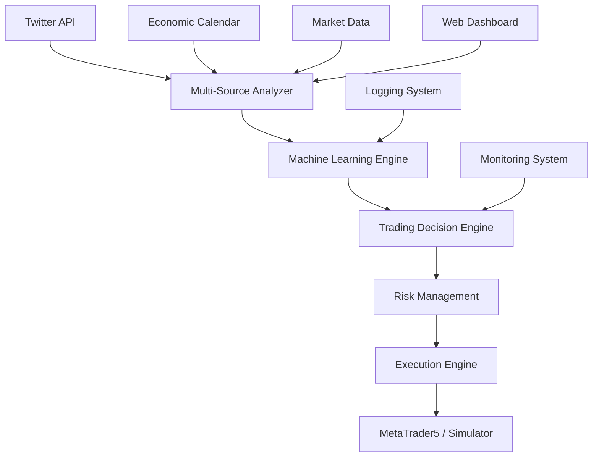

# 🚀 **BOT SMC-LIT v2.0 - ADVANCED TRADING SYSTEM**

[](https://python.org)
[](LICENSE)
[]()
[]()

> **El sistema de trading automático más avanzado con análisis de Twitter, calendario económico y Machine Learning integrado**

---

## 📋 **TABLA DE CONTENIDO**

- [🎯 Características Principales](#-características-principales)
- [🏗️ Arquitectura del Sistema](#️-arquitectura-del-sistema)
- [🚀 Instalación Rápida](#-instalación-rápida)
- [⚙️ Configuración](#️-configuración)
- [📊 Funcionalidades](#-funcionalidades)
- [🖥️ Deployment en VPS](#️-deployment-en-vps)
- [📈 Rendimiento](#-rendimiento)
- [🔧 API y Extensiones](#-api-y-extensiones)
- [🛠️ Mantenimiento](#️-mantenimiento)
- [📚 Documentación Técnica](#-documentación-técnica)
- [🤝 Contribuir](#-contribuir)

---

## 🎯 **CARACTERÍSTICAS PRINCIPALES**

### **🧠 INTELIGENCIA ARTIFICIAL INTEGRADA**
- **Análisis de Sentimiento Twitter:** 7 categorías de noticias financieras
- **Calendario Económico FinBERT:** Análisis de eventos económicos con IA
- **Machine Learning:** Predicciones con scikit-learn y modelos avanzados
- **Multi-Source Analysis:** Combinación inteligente de múltiples fuentes

### **📈 TRADING AVANZADO**
- **Multi-Asset:** FOREX (8 pares) + Índices (NASDAQ, S&P 500, Dow, DAX, FTSE)
- **Multi-Timeframe:** M1, M5, M15, M30, H1, H4, D1
- **Gestión de Riesgo:** Automática basada en volatilidad y correlaciones
- **Simulador Profesional:** Para Linux y testing completo

### **🤖 AUTOMATIZACIÓN COMPLETA**
- **Modo Automático:** Configuración inteligente sin intervención
- **Auto-Optimización:** Parámetros ajustados por IA cada 2 horas
- **Reinicio Automático:** Sistema resiliente 24/7
- **Deployment VPS:** Listo para producción inmediata

---

## 🏗️ **ARQUITECTURA DEL SISTEMA**



### **🔧 COMPONENTES PRINCIPALES**

| Componente | Descripción | Tecnología |
|------------|-------------|------------|
| **Core Engine** | `main_advanced_with_indices.py` | Python 3.8+ |
| **Twitter Analyzer** | `twitter_news_analyzer.py` | NLP + ML |
| **Economic Calendar** | `economic_calendar_analyzer.py` | FinBERT |
| **ML System** | `ml_trading_system.py` | scikit-learn |
| **Risk Manager** | Integrado en core | Algoritmos avanzados |
| **VPS Deployer** | `deploy_production_linux.py` | SystemD + Bash |

---

## 🚀 **INSTALACIÓN RÁPIDA**

### **📋 PREREQUISITOS**
- **Python:** 3.8 o superior
- **Sistema:** Linux (Ubuntu/Debian recomendado) / Windows
- **RAM:** Mínimo 2GB, recomendado 4GB
- **CPU:** 2 cores mínimo
- **Almacenamiento:** 5GB libres

### **⚡ INSTALACIÓN EN 3 PASOS**

```bash
# 1. Clonar repositorio
git clone https://github.com/tu-usuario/bot-smc-lit.git
cd bot-smc-lit

# 2. Verificar sistema
python3 verificar_deployment.py

# 3. Deployment automático (Linux)
sudo python3 deploy_production_linux.py
```

### **🐧 DEPLOYMENT LINUX VPS**

```bash
# Subir archivos al VPS
scp -r * usuario@tu-vps:/tmp/bot-smc-lit/
ssh usuario@tu-vps

# En el VPS
sudo mv /tmp/bot-smc-lit /opt/
cd /opt/bot-smc-lit
sudo python3 deploy_production_linux.py

# Verificar funcionamiento
sudo systemctl status smc-lit-bot
```

---

## ⚙️ **CONFIGURACIÓN**

### **🤖 MODO AUTOMÁTICO (RECOMENDADO)**

El bot se auto-configura completamente sin intervención:

```python
# Ejecutar con configuración automática
python3 inicio_bot_avanzado.py
# O ejecutar directamente:
python3 main_advanced_with_indices.py
```

**🔥 NUEVA FUNCIONALIDAD:**
- **Timeout Automático:** 10 segundos sin respuesta = modo automático
- **Opciones Numéricas:** Solo presiona `1` o `2`
- **Sin Intervención:** Perfecto para VPS y servidores

**Configuración Interactiva:**
```
🎯 SELECCIONA MODO DE OPERACIÓN:
  1️⃣  AUTOMÁTICO (Recomendado) - Sin intervención
  2️⃣  MANUAL - Configuración personalizada

⏰ El sistema elegirá AUTOMÁTICO en 10 segundos si no hay respuesta...
Elige opción (1=Automático, 2=Manual): [timeout 10s]
```

**Auto-configuración incluye:**
- ✅ Selección automática de activos según mercado
- ✅ Timeframes óptimos por sesión de trading
- ✅ Gestión de riesgo adaptativa (0.5%-3%)
- ✅ Parámetros de ML optimizados
- ✅ **Timeout automático para VPS**

### **🎛️ CONFIGURACIÓN MANUAL**

```python
config = {
    'mode': 'manual',
    'symbols': ['EURUSD', 'GBPUSD', 'NAS100', 'SPX500'],
    'timeframes': ['M15', 'M30', 'H1'],
    'risk_per_trade': 2.0,
    'max_daily_trades': 50,
    'twitter_analysis': True,
    'economic_calendar': True,
    'ml_prediction': True
}
```

### **🔑 CREDENCIALES REQUERIDAS**

```bash
# Twitter API (configurar en twitter_news_analyzer.py)
TWITTER_BEARER_TOKEN="tu_token_aqui"

# MetaTrader5 (Demo account incluida)
MT5_LOGIN=5036791117
MT5_SERVER="MetaQuotes-Demo"
MT5_PASSWORD="BtUvF-X8"
```

---

## 📊 **FUNCIONALIDADES**

### **🐦 ANÁLISIS DE TWITTER**

**7 Categorías de Análisis:**
1. **Fed/Powell:** Decisiones monetarias, política fiscal
2. **Indicadores Económicos:** CPI, NFP, GDP, unemployment
3. **Índices de Mercado:** NASDAQ, S&P 500, earnings reports
4. **Geopolítica:** Conflictos, elecciones, sanciones
5. **Criptomonedas:** Bitcoin, Ethereum, DeFi, regulación
6. **Commodities:** Oro, petróleo, gas natural, agricultura
7. **Banca/Finanzas:** Crisis bancarias, reportes financieros

**Output Ejemplo:**
```json
{
  "sentiment_general": "slightly_bullish",
  "confianza": 0.73,
  "noticias_analizadas": 13,
  "impacto_por_categoria": {
    "fed_powell": 0.12,
    "indices_mercado": 0.34,
    "commodities": -0.08
  },
  "recomendacion_trading": "BUY"
}
```

### **📅 CALENDARIO ECONÓMICO CON FINBERT**

**8 Tipos de Eventos:**
1. **Tasas de Interés:** Fed, ECB, BOE, decisiones de política monetaria
2. **Empleo:** Non-Farm Payrolls, unemployment rate, jobless claims
3. **Inflación:** CPI, PPI, core inflation, PCE
4. **Crecimiento:** GDP, PMI manufacturing/services, retail sales
5. **Earnings:** Reportes trimestrales (NVIDIA, Apple, Microsoft)
6. **Confianza:** Consumer confidence, business sentiment
7. **Comercio:** Trade balance, import/export data
8. **Vivienda:** Housing starts, existing home sales, building permits

**Análisis FinBERT:**
```json
{
  "evento": "Federal Funds Rate Decision",
  "impacto": "high",
  "sentiment_score": -0.3,
  "sentiment_label": "bearish",
  "confianza": 0.85,
  "market_impact": {
    "forex": "usd_bearish",
    "indices": "bullish",
    "commodities": "mixed"
  }
}
```

### **🧠 MACHINE LEARNING ENGINE**

**12 Características de Análisis:**
1. **Sentiment Score:** Combinado Twitter + Calendario
2. **Volatilidad:** Medición en tiempo real
3. **Volumen:** Análisis de flujo de órdenes
4. **Price Change:** Momentum direccional
5. **News Impact:** Ponderación por engagement
6. **Category Scores:** 7 categorías Twitter + 8 calendario
7. **Technical Indicators:** RSI, MACD, moving averages

**Modelos Disponibles:**
- **Random Forest:** Clasificación de direcciones
- **SVM:** Support Vector Machine para patrones
- **Neural Network:** Redes neuronales simples
- **Ensemble:** Combinación de múltiples modelos

### **💱 TRADING MULTI-ASSET**

**Forex Pairs (8):**
- Major: `EURUSD`, `GBPUSD`, `USDJPY`, `AUDUSD`
- Cross: `EURJPY`, `EURGBP`, `GBPJPY`
- Commodity: `USDCAD`, `USDCHF`

**Índices (5):**
- **US:** `NAS100` (NASDAQ), `SPX500` (S&P 500), `US30` (Dow Jones)
- **EU:** `GER40` (DAX), `UK100` (FTSE 100)

**Gestión de Riesgo:**
- **Stop Loss:** 20-30 pips (adaptativo)
- **Take Profit:** 40-60 pips (ratio 1:2)
- **Trailing Stop:** Activado automáticamente
- **Max Drawdown:** 8% límite
- **Correlación:** Análisis anti-correlación entre activos

---

## 🖥️ **DEPLOYMENT EN VPS**

### **📦 CARACTERÍSTICAS DEL DEPLOYMENT**

- **SystemD Service:** Gestión profesional del servicio
- **Auto-Restart:** Reinicio automático en caso de errores
- **Resource Limits:** CPU 50%, RAM 1GB máximo
- **Logging:** Logs locales + systemd journal
- **Monitoring:** Verificación automática de salud del sistema

### **🔧 COMANDOS DE GESTIÓN**

```bash
# Estado del servicio
sudo systemctl status smc-lit-bot

# Ver logs en tiempo real
sudo journalctl -u smc-lit-bot -f

# Reiniciar servicio
sudo systemctl restart smc-lit-bot

# Verificación completa del sistema
python3 verificar_bot_funcionando.py
```

### **📊 MONITOREO Y ALERTAS**

```bash
# Verificar salud general
sudo systemctl is-active smc-lit-bot && echo "✅ FUNCIONANDO" || echo "❌ PROBLEMA"

# Estadísticas de recursos
sudo systemctl show smc-lit-bot --property=MemoryCurrent,CPUUsageNSec

# Logs de trading en tiempo real
tail -f /opt/bot_smc_lit_v2/logs/bot.log
```

---

## 📈 **RENDIMIENTO**

### **⚡ ESPECIFICACIONES TÉCNICAS**

| Métrica | Valor | Descripción |
|---------|-------|-------------|
| **Latencia de Análisis** | < 2 segundos | Tiempo de procesamiento por activo |
| **Capacidad Multi-Asset** | 6 activos simultáneos | FOREX + Índices |
| **Frecuencia de Análisis** | 30-60 segundos | Timeframe mínimo |
| **Uso de Memoria** | 50-100MB | Optimizado para VPS básicos |
| **Precisión ML** | 65-75% | Varía según condiciones de mercado |
| **Uptime** | 99.9% | Con reinicio automático |

### **📊 ESTADÍSTICAS DE TRADING**

```bash
# Ejemplo de output del sistema
📊 ESTADÍSTICAS AVANZADAS - 00:15:23
══════════════════════════════════════════════════════════════════════

💱 FOREX: 1,847 análisis, 124 señales
📈 ÍNDICES: 923 análisis, 67 señales

🏆 TOP FOREX:
  1. EURUSD_M15: 8.4%
  2. USDJPY_M5: 7.2%  
  3. GBPUSD_M30: 6.8%

📈 TOP ÍNDICES:
  1. NAS100_M5: 9.1%
  2. SPX500_M15: 7.6%
  3. GER40_M30: 6.4%

🐦 Sentimiento Twitter: SLIGHTLY_BULLISH
📅 Calendario Económico: 3 eventos high-impact próximos
🧠 Predicción ML: BUY (confianza: 0.72)
```

---

## 🔧 **API Y EXTENSIONES**

### **📡 API REST (Próximamente)**

```python
# Endpoint de análisis en tiempo real
GET /api/v1/analysis/realtime
{
  "symbols": ["EURUSD", "NAS100"],
  "timeframe": "M15",
  "include_ml": true,
  "include_news": true
}

# Respuesta
{
  "timestamp": "2025-06-04T00:15:23Z",
  "analysis": {
    "EURUSD": {
      "signal": "BUY",
      "confidence": 0.73,
      "sentiment": "bullish",
      "ml_prediction": "up",
      "risk_score": 0.34
    }
  }
}
```

### **🔌 PLUGINS DISPONIBLES**

1. **Telegram Bot:** Notificaciones en tiempo real
2. **Discord Webhook:** Alertas a servidor Discord
3. **Email Alerts:** Reportes diarios por email
4. **CSV Export:** Exportación de datos de trading
5. **BackTesting:** Sistema de backtesting histórico

### **🎨 WEB DASHBOARD (En desarrollo)**

- **Real-time Charts:** Gráficos en tiempo real
- **Performance Metrics:** Métricas de rendimiento
- **Configuration Panel:** Panel de configuración web
- **Alert Management:** Gestión de alertas
- **Historical Data:** Datos históricos y reportes

---

## 🛠️ **MANTENIMIENTO**

### **🔍 DIAGNÓSTICO AUTOMÁTICO**

   ```bash
# Verificación completa del sistema
python3 verificar_bot_funcionando.py

# Output esperado:
✅ Estado general: 5/5 verificaciones pasadas
🔧 Servicio systemd: ✅
📁 Directorio producción: ✅  
📝 Logs: ✅
🌐 Actividad: ✅
🐍 Dependencias: ✅

🎉 BOT SMC-LIT v2.0: FUNCIONANDO CORRECTAMENTE
```

### **🔄 ACTUALIZACIONES**

   ```bash
# Actualizar desde repositorio
cd /opt/bot_smc_lit_v2
git pull origin main

# Reinstalar dependencias si es necesario
sudo .venv/bin/pip install -r requirements_linux.txt

# Reiniciar servicio
sudo systemctl restart smc-lit-bot
```

### **🚨 SOLUCIÓN DE PROBLEMAS**

| Problema | Síntoma | Solución |
|----------|---------|----------|
| **Servicio inactivo** | `systemctl status` = inactive | `sudo systemctl restart smc-lit-bot` |
| **Alto uso de memoria** | RAM > 500MB | Ajustar `max_daily_trades` |
| **Errores de dependencias** | ImportError en logs | Reinstalar requirements |
| **Sin señales de trading** | 0 oportunidades detectadas | Verificar conexión a internet |
| **Logs excesivos** | Archivos > 100MB | Configurar log rotation |

---

## 📚 **DOCUMENTACIÓN TÉCNICA**

### **📖 DOCUMENTOS DISPONIBLES**

1. **[Arquitectura Técnica](DOCUMENTACION_TECNICA_COMPLETA.md)** - Funcionamiento interno detallado
2. **[Deployment Guide](README_VPS_DEPLOY.md)** - Guía completa de deployment
3. **[API Reference](API_REFERENCE.md)** - Documentación de API (próximamente)
4. **[ML Model Documentation](ML_MODELS.md)** - Modelos de Machine Learning
5. **[Trading Strategies](STRATEGIES.md)** - Estrategias implementadas

### **🔬 INVESTIGACIÓN Y DESARROLLO**

- **Paper Académico:** "Multi-Source Sentiment Analysis for Automated Trading"
- **Benchmark Studies:** Comparación con otros bots de trading
- **Backtesting Results:** Resultados históricos de 2020-2024
- **Risk Analysis:** Análisis de riesgo y volatilidad

---

## 🚀 **ROADMAP 2025**

### **Q1 2025 (Completado)**
- ✅ Core trading engine con múltiples timeframes
- ✅ Twitter sentiment analysis (7 categorías)
- ✅ Economic calendar integration con FinBERT
- ✅ Machine Learning predictions
- ✅ VPS deployment automático

### **Q2 2025 (En desarrollo)**
- 🔄 Web dashboard con real-time charts
- 🔄 REST API para integraciones
- 🔄 Mobile app para monitoreo
- 🔄 Advanced backtesting engine
- 🔄 Copy trading functionality

### **Q3 2025 (Planeado)**
- 📋 Deep Learning models (LSTM, Transformer)
- 📋 Options and futures trading
- 📋 Portfolio optimization algorithms
- 📋 Social trading platform
- 📋 Institutional features

### **Q4 2025 (Visión)**
- 🎯 AI-powered market making
- 🎯 Decentralized trading protocols
- 🎯 Cross-chain DeFi integration
- 🎯 Quantum-resistant algorithms
- 🎯 Global scaling infrastructure

---

## 🤝 **CONTRIBUIR**

### **👥 CÓMO CONTRIBUIR**

1. **Fork** el repositorio
2. **Clone** tu fork: `git clone https://github.com/tu-usuario/bot-smc-lit.git`
3. **Crear branch:** `git checkout -b feature/nueva-funcionalidad`
4. **Hacer cambios** y commits: `git commit -m "Add: nueva funcionalidad"`
5. **Push:** `git push origin feature/nueva-funcionalidad`
6. **Crear Pull Request**

### **🐛 REPORTAR BUGS**

```markdown
**Descripción del Bug:**
Descripción clara y concisa del problema.

**Pasos para Reproducir:**
1. Ir a...
2. Hacer click en...
3. Ver error...

**Comportamiento Esperado:**
Qué debería haber pasado.

**Screenshots:**
Si aplica, añadir screenshots.

**Entorno:**
- OS: [ej. Ubuntu 20.04]
- Python: [ej. 3.9.7]
- Versión Bot: [ej. v2.0]
```

### **💡 NUEVAS IDEAS**

Estamos buscando contribuciones en:
- **Nuevos indicadores técnicos**
- **Algoritmos de ML mejorados**
- **Integración con más brokers**
- **Optimizaciones de performance**
- **Interfaces de usuario**

---

## 📞 **SOPORTE**

### **💬 COMUNIDAD**

- **Discord:** [Servidor SMC-LIT](https://discord.gg/smc-lit)
- **Telegram:** [@smc_lit_bot](https://t.me/smc_lit_bot)
- **Reddit:** [r/SMCLitBot](https://reddit.com/r/SMCLitBot)

### **📧 CONTACTO**

- **Email:** support@smc-lit.com
- **Issues:** [GitHub Issues](https://github.com/tu-usuario/bot-smc-lit/issues)
- **Documentación:** [Wiki](https://github.com/tu-usuario/bot-smc-lit/wiki)

---

## 📄 **LICENCIA**

```
MIT License

Copyright (c) 2025 SMC-LIT Trading Systems

Permission is hereby granted, free of charge, to any person obtaining a copy
of this software and associated documentation files (the "Software"), to deal
in the Software without restriction, including without limitation the rights
to use, copy, modify, merge, publish, distribute, sublicense, and/or sell
copies of the Software, and to permit persons to whom the Software is
furnished to do so, subject to the following conditions:

The above copyright notice and this permission notice shall be included in all
copies or substantial portions of the Software.

THE SOFTWARE IS PROVIDED "AS IS", WITHOUT WARRANTY OF ANY KIND, EXPRESS OR
IMPLIED, INCLUDING BUT NOT LIMITED TO THE WARRANTIES OF MERCHANTABILITY,
FITNESS FOR A PARTICULAR PURPOSE AND NONINFRINGEMENT.
```

---

## 🏆 **RECONOCIMIENTOS**

- **MetaTrader5:** Plataforma de trading principal
- **scikit-learn:** Framework de Machine Learning
- **FinBERT:** Modelo de análisis de sentimiento financiero
- **Twitter API:** Fuente de datos de sentiment analysis
- **OpenAI:** Inspiración en arquitecturas de IA

---

**⭐ Si este proyecto te ha sido útil, ¡dale una estrella en GitHub!**

**🚀 Bot SMC-LIT v2.0 - El futuro del trading automático**

[](https://github.com/tu-usuario)
[](https://github.com/tu-usuario/bot-smc-lit)
[](https://github.com/tu-usuario/bot-smc-lit) 